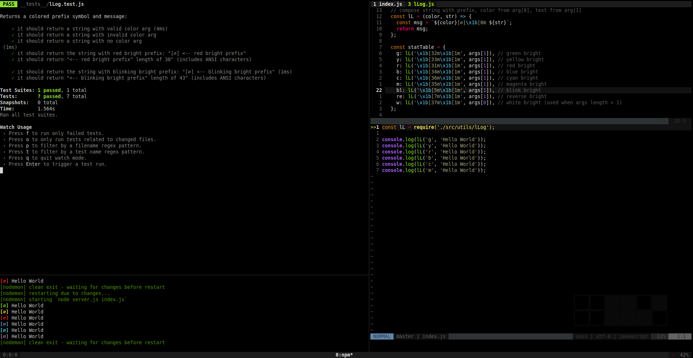

# boil-node-jest-eslint



## info

Minimal starter for Node.js. Configured with Jest, ESLint and Nodemon:
Clone. Run. Test. Build.

### structure

- "Hello World" `index.js` ready to run.
- Example module in  `src/utils` that logs color message.
- Example test file for the module in `__tests__`.

### install

```sh
git clone <this-directory-path> <destination-path>
cd <destination-path>
npm install
```

### run

`npm start`

### test

```sh
npm test
npm test -- --watchAll
npm test -- --coverage
```

### config files

- `.eslintrc.js` - airbnb, jest, import
- `jsconfig.json` - useful for Coc, Syntastic, VS?, ...

### devDependencies

- `jest`
- `nodemon` - in case it's not installed globally
- `@types/jest` - auto-complete and linting support (tsserver, Coc, ALE, YCM, ...)
- `eslint`
- `eslint-config-airbnb-base`
- `eslint-plugin-import`
- `eslint-plugin-jest`
